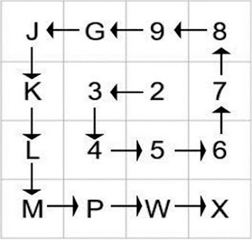

# DIGIPIN Concept Guide

## Introduction

DIGIPIN (Digital Postal Index Number) is a revolutionary geographic encoding system developed by India Post to represent any location within India using a simple 10-character alphanumeric code. This guide explains the technical concepts behind DIGIPIN and how it works.

## How DIGIPIN Works

### Grid System



DIGIPIN uses a hierarchical grid system that divides India's geographic area into progressively smaller grids:

1. The initial grid (Level 1) divides India into 4x4 cells
2. Each cell is further divided into 4x4 subcells
3. This division continues for multiple levels to achieve high precision

### Code Structure

A DIGIPIN code follows the format: XXX-XXX-XXXX


- First character: Level 1 grid cell (using L1 lookup table)
- Subsequent characters: Level 2-10 grid cells (using L2 lookup table)
- Hyphens are added after the 3rd and 6th characters for readability

### Lookup Tables

#### L1 Table (First Level)
```
┌───┬───┬───┬───┐
│ 0 │ 2 │ 0 │ 0 │
├───┼───┼───┼───┤
│ 3 │ 4 │ 5 │ 6 │
├───┼───┼───┼───┤
│ G │ 8 │ 7 │ M │
├───┼───┼───┼───┤
│ J │ 9 │ K │ L │
└───┴───┴───┴───┘
```

#### L2 Table (Subsequent Levels)
```
┌───┬───┬───┬───┐
│ J │ G │ 9 │ 8 │
├───┼───┼───┼───┤
│ K │ 3 │ 2 │ 7 │
├───┼───┼───┼───┤
│ L │ 4 │ 5 │ 6 │
├───┼───┼───┼───┤
│ M │ P │ W │ X │
└───┴───┴───┴───┘
```

## Geographic Coverage


The system covers:
- Latitude: 1.5°N to 39.0°N
- Longitude: 63.5°E to 99.0°E

This range includes:
- Mainland India
- Andaman and Nicobar Islands
- Lakshadweep Islands
- Buffer zones around all territories

## Precision Levels

Each character in the DIGIPIN code increases location precision:
1. First character: ~400km
2. Second character: ~100km
3. Third character: ~25km
4. Fourth character: ~6km
5. Fifth character: ~1.5km
6. Subsequent characters: Further refinement down to ~1-2 meters

## Use Cases

1. **Postal Services**
   - Precise delivery locations
   - Automated sorting
   - Route optimization

2. **Emergency Services**
   - Quick location identification
   - Faster response times
   - Unambiguous location sharing

3. **Business Applications**
   - Location-based services
   - Delivery optimization
   - Asset tracking

4. **Navigation**
   - Precise destination input
   - Waypoint marking
   - Location sharing

## Resources

For more detailed information about DIGIPIN, refer to:

1. [Official DIGIPIN Technical Documentation](https://www.indiapost.gov.in/Navigation_Documents/Static_Navigation/DIGIPIN%20Technical%20Document%20Final%20English.pdf)
2. [India Post DIGIPIN Portal](https://www.indiapost.gov.in)

## Implementation Notes

### Encoding Process
1. Input: Latitude/Longitude coordinates
2. Check if coordinates are within bounds
3. Apply hierarchical grid division
4. Look up grid cell values in L1/L2 tables
5. Format with hyphens

### Decoding Process
1. Input: DIGIPIN code
2. Remove hyphens
3. Process each character sequentially
4. Use L1/L2 tables to identify grid cells
5. Calculate final coordinates
